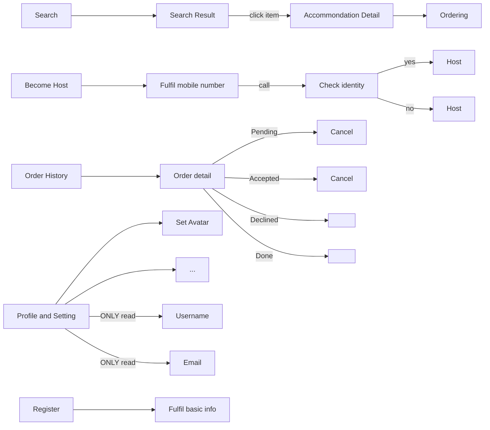
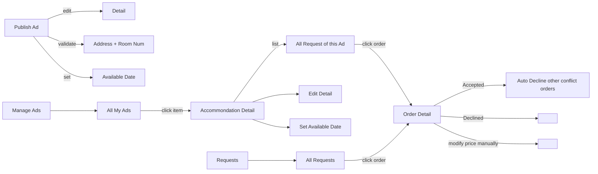

# NOTICE!!!
>"Nope! Due to a performance-related quirk in Git, you can not negate a file that is ignored due to a pattern matching a directory"

Because of the fucking stupid reason, these code does not work:

~~!migrations/__init__.py~~

~~!crawler/requirements.txt~~

~~!crawler/crawl_airbnb.py~~

use `git add -f $file` to add these files manually.
# Setup
Run `setup.sh`

This script is built for Ubuntu 16.04 LTS. Make sure you have the root permission.
# Crawl
In directory `crawler`, run `crawl_airbnb.py`.

It generates a `data.json` file and `album` directory. The structure of `album` is:

    -album
        |-{user_id}
            |-{item_id}
                |-0.jpg
                |-1.jpg
                ...
# Frontend
[](https://github.com/alibaba/ice)

In `ice` dirctory. Import this directory into `Icework` to build.

Notice the code in `miniAirbnb/setting.py`:
```python
STATIC_URL = '/static/'
STATICFILES_DIRS = [
    os.path.join(BASE_DIR, 'ice'),
]
```
and the code in `homepage/views.py`:
```python
def index(request):
    return redirect('/static/build/index.html')
```

***Think the path relationship carefully!!***

# Database
We use PostgresSQL instead of the default SQLite. So please read the `setting.py`.
```python
DATABASES = {
    'default': {
        'ENGINE': 'django.db.backends.postgresql',
        'NAME': 'miniairbnb',
        'USER': 'admin',
        'PASSWORD': '123321',
        'HOST': 'localhost',
        'PORT': ''
    }
}
```
Please **NOTICE** that, the name of database is **non** *case-sensitive*. However, in code(like `Ptython`), it is.

# Workflow
### Guest
##### NavigationBar
There is a NavigationBar at the head of almost all pages.
The bar includes:

- Search Box

    Basic search box with `Check in/out Date` and `Num of Guest` as optinal.

- Register/Login

    Goto a new screen or popup a dialog?
    Need `Username`, `Email`, `First Name` `Last Name`, `DoB`, `Password` to register as a guest by default.
    Use `Email` to login.

- Become Host

    If click, goto a new screen to validate the user by `Mobile Number`. Maybe we can make a phone call to achieve it. This means we need a management backend to approve it **manually**.

- Order History

    Orders are displayed chronologically in a Listview. Item can be clicked and goto view (or manipulate depending on the status) the order detail.
    There are totally *5* statuses in the lifecycle of orders:

    1. Pending

        The order is placed by guest, waiting for host to confirm. A *Pending* order should be set `Declined` automatically if there is no response from host when less than 24 hours before the order starts.
        Guest can cancel the order freely during this status.

    2. Accepted/Declined

        The order is confirmed by host.
        `Accepted` order can be cancelled by guest according to the `Cancellation Rules` freely or charged with extra cost.

    3. Done
        
        When it goes pass the `Checkout Date`, a normal status order is `Done`.
        A `Declined` or `Cancelled` order will always be displayed as the special statused.

- Profile and Setting

    Display the avatar of current user.
    Allow user to edit his personal information ***except*** `Username` and `Email`.
    Reser password (by Email).

##### Home Page
- NavigationBar

    Which may trigger a big search box like Google.

- Ads
    Some accommondations recommended as ad.

##### Search Result
- Search Box

    A Taobao like search box at head with these funtions:

    - Basic search fucntion mentioned above, `Check in/out Date`, `Num of Guest`

    - Sorting
        
        By `Price`, `Distance`, `Rating`

    - Filtering

        Has several dimensions:
            - Variable range, like `Price`, `Distance`, `Rating`
            - Enum type, like `Type` of accommodation (`Flat`, `House`, `Apartment`), `Wi-Fi`, `Parking`, `Non-smoking`, etc

- Search Result

    Gridview or Listview. Mapview is optional

- Accommondation Item

    The items shown in the list, displaying `Thumb`, `Type`, `Title`, `Price`, `Rating`, `Distance`

##### Accommondation Detail
When click on the item in the list, goto the detail page of this accommondation. It shows the every detail of this accommondation, including:
> `Album`, `Type`, `Num of Guest`, `Num of Bedroom`, `Num of Bed`, `Num of Bathroom`, `Price`, `Rating`, `Title`, `Description`, `Facilities`, `Address`, `Cancellation Rules`, `Avaliable Date`.

Review function is optinal.

##### Ordering
1. Should check login status first. If not logged in, goto `Register/Login`.

2. Select `Check in/out Date` and `Num of Guest`

3. Show pre-order detail, including `Title`, `Check in/out Date`, `Num of Guest`, `Total Price`. User can add a `Comment` to this order. Click ***Place Order*** button to place this order.

4. Show success. After 2s goto `Home Page` or `Order History`.

#### [Workflow of Guest](https://mermaidjs.github.io/mermaid-live-editor/#/view/eyJjb2RlIjoiZ3JhcGggTFI7XG4gICAgMDBbUmVnaXN0ZXJdLS0-MDFbRnVsZmlsIGJhc2ljIGluZm9dO1xuXG4gICAgMTBbU2VhcmNoXS0tPjExW1NlYXJjaCBSZXN1bHRdO1xuICAgIDExLS0-fGNsaWNrIGl0ZW18MTJbQWNjb21tb25kYXRpb24gRGV0YWlsXTtcbiAgICAxMi0tPjEzW09yZGVyaW5nXTtcblxuICAgIDIwW0JlY29tZSBIb3N0XS0tPjIxW0Z1bGZpbCBtb2JpbGUgbnVtYmVyXTtcbiAgICAyMS0tPnxjYWxsfDIyW0NoZWNrIGlkZW50aXR5XTtcbiAgICAyMi0tPnx5ZXN8MjNbSG9zdF07XG4gICAgMjItLT58bm98MjRbSG9zdF07XG5cbiAgICAzMFtPcmRlciBIaXN0b3J5XS0tPjMxW09yZGVyIGRldGFpbF07XG4gICAgMzEtLT58UGVuZGluZ3wzMltDYW5jZWxdO1xuICAgIDMxLS0-fEFjY2VwdGVkfDMzW0NhbmNlbF07XG4gICAgMzEtLT58RGVjbGluZWR8MzRbIF07XG4gICAgMzEtLT58RG9uZXwzNVsgXTtcblxuICAgIDQwW1Byb2ZpbGUgYW5kIFNldHRpbmddLS0-NDFbU2V0IEF2YXRhcl07XG4gICAgNDAtLT40MlsuLi5dO1xuICAgIDQwLS0-fE9OTFkgcmVhZHw0M1tVc2VybmFtZV07XG4gICAgNDAtLT58T05MWSByZWFkfDQ0W0VtYWlsXTsiLCJtZXJtYWlkIjp7InRoZW1lIjoiZGVmYXVsdCJ9fQ)



### Host
##### NavigationBar
- Become Host

    If user has requested (hasn't been approved), it shows a screen as 'In progress...'.
    If user has became a Host, this button show be `Manage Ads` (or `Publish Ad`).

- Manage Ads

    It shows all the Ads this Host published. The style is like the Listview in search result.
    Click one item and go into the accommondation detail page. It shows everything like the Guest's, but with editable function.
    It also shows all the order request of this accommondation.
    Host can process. **When the during of one order has been aprroved, the other orders which conflict with this order should be set `Declined` automatically**.
    Host can also modify the price of one order manually.

- Requests

    It shows the request order from Guest waiting for confirmation chronologically.
    Host can process this particular request by clicking into.

- Publish Ad

    Allow user to public and edit all the things mentioned in `item_detail`.
    Specifically, the `Available Date` needs more thinking before design.
    Ah, the most important part, we use the `Address` and the 
    `Room Num`? to indentify the accommondation (Ad). This means, **duplicate** post is not allowed.

#### [Workflow of Host](https://mermaidjs.github.io/mermaid-live-editor/#/view/eyJjb2RlIjoiZ3JhcGggTFI7XG4gICAgMDBbTWFuYWdlIEFkc10tLT4wMVtBbGwgTXkgQWRzXTtcbiAgICAwMS0tPnxjbGljayBpdGVtfDAyW0FjY29tbW9uZGF0aW9uIERldGFpbF07XG4gICAgMDItLT4wMjFbRWRpdCBEZXRhaWxdO1xuICAgIDAyLS0-MDIyW1NldCBBdmFpbGFibGUgRGF0ZV07XG4gICAgMDItLT58bGlzdHwwMjNbQWxsIFJlcXVlc3Qgb2YgdGhpcyBBZF07XG4gICAgMDIzLS0-fGNsaWNrIG9yZGVyfDAyNFtPcmRlciBEZXRhaWxdO1xuICAgIDAyNC0tPnxBY2NlcHRlZHwwMjVbQXV0byBEZWNsaW5lIG90aGVyIGNvbmZsaWN0IG9yZGVyc107XG4gICAgMDI0LS0-fERlY2xpbmVkfDAyNlsgXTtcbiAgICAwMjQtLT58bW9kaWZ5IHByaWNlIG1hbnVhbGx5fDAyN1sgXTtcblxuICAgIDEwW1JlcXVlc3RzXS0tPjExW0FsbCBSZXF1ZXN0c107XG4gICAgMTEtLT58Y2xpY2sgb3JkZXJ8MDI0O1xuXG4gICAgMjBbUHVibGlzaCBBZF0tLT58ZWRpdHwyMVtEZXRhaWxdO1xuICAgIDIwLS0-fHZhbGlkYXRlfDIyW0FkZHJlc3MgKyBSb29tIE51bV07XG4gICAgMjAtLT58c2V0fDIzW0F2YWlsYWJsZSBEYXRlXTsiLCJtZXJtYWlkIjp7InRoZW1lIjoiZGVmYXVsdCJ9fQ)


# API
### Register
```
POST /login/register/
```
- **username**
- **email**
- **password**
- **firstname**
- **lastname**
- **birthday** format: YYYY-MM-DD
##### Possible error codes:
- **100**(400) User exists
##### Success response:
```json
{
    "code": 200,
    "msg": "Success register",
    "data": {
        "user": "aabbcc",
        "uid": 1234,
        "avatar": "http://xxx.xxx/avatar.png"
        }
}
```
### Login
```
POST /login/
```
- **username**
- **password**
##### Possible error codes:
- **101**(400) Wrong password
- **102**(400) User not found
##### Success response:
```json
{
    "code": 200,
    "msg": "Success Login",
    "data": {
        "user": "aabbcc",
        "uid": 1234,
        "avatar": "http://xxx.xxx/avatar.png",
        "is_host": False,
        "is_pending_host": False
        }
}
```