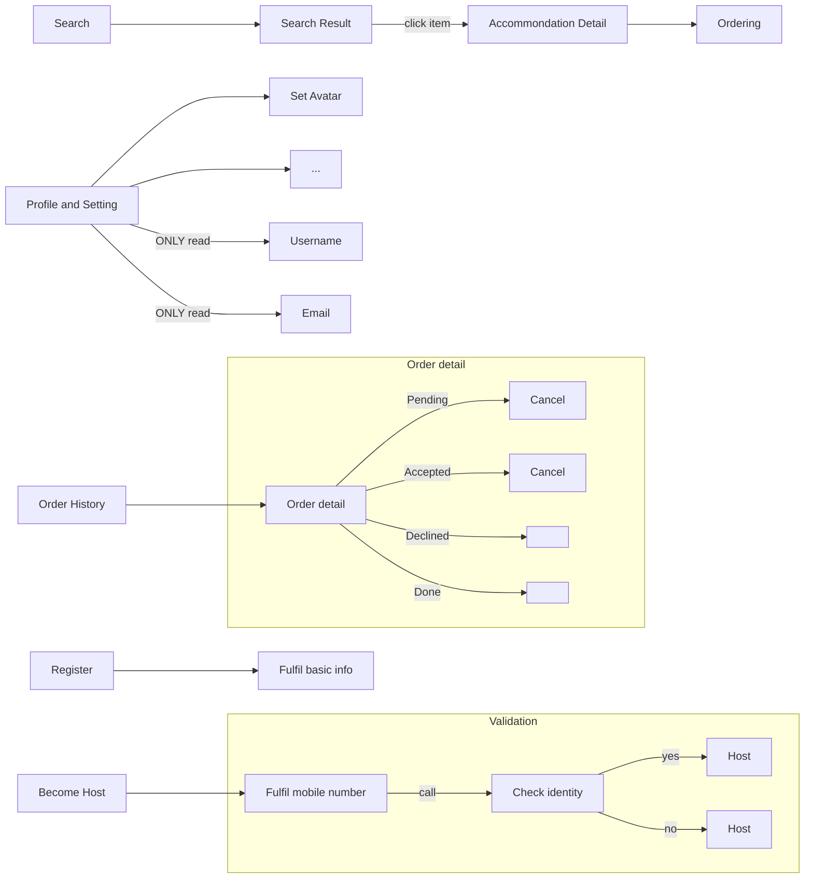

#Setup
run `setup.sh`
This script is built for Ubuntu 16.04 LTS. Make sure you have the root permission.
#Database
We use PostgresSQL instead of the default SQLite. So please read the `setting.py`.
```python
DATABASES = {
    'default': {
        'ENGINE': 'django.db.backends.postgresql',
        'NAME': 'miniairbnb',
        'USER': 'admin',
        'PASSWORD': '123321',
        'HOST': 'localhost',
        'PORT': ''
    }
}
```
Please **NOTICE** that, the name of database is **non** *case-sensitive*. However, in code(like `Ptython`), it is.

#Workflow
###Guest
#####NavigationBar
There is a NavigationBar at the head of almost all pages.
The bar includes:

- Search Box
Basic search box with `Check in/out Date` and `Num of Guest` as optinal.
- Register/Login
Goto a new screen or popup a dialog?
Need `Username`, `Email`, `First Name` `Last Name`, `DoB`, `Password` to register as a guest by default.
Use `Email` to login.
- Become Host
If click, goto a new screen to validate the user by `Mobile Number`. Maybe we can make a phone call to achieve it. This means we need a management backend to approve it **manually**.
- Order History
Orders are displayed chronologically in a Listview. Item can be clicked and goto view (or manipulate depending on the status) the order detail.
There are totally *5* statuses in the lifecycle of orders:
    1. Pending
    The order is placed by guest, waiting for host to confirm. A *Pending* order should be set `Declined` automatically if there is no response from host when less than 24 hours before the order starts.
    Guest can cancel the order freely during this status.
    2. Accepted/Declined
    The order is confirmed by host.
    `Accepted` order can be cancelled by guest according to the `Cancellation Rules` freely or charged with extra cost.
    3. Done
    When it goes pass the `Checkout Date`, a normal status order is `Done`.
    A `Declined` or `Cancelled` order will always be displayed as the special statused.
- Profile and Setting
Display the avatar of current user.
Allow user to edit his personal information ***except*** `Username` and `Email`.
Reser password (by Email).
#####Home Page
- NavigationBar
Which may trigger a big search box like Google.
- Ads
Some accommondations recommended as ad.
#####Search Result
- Search Box
A Taobao like search box at head with these funtions:
    - Basic search fucntion mentioned above, `Check in/out Date`, `Num of Guest`
    - Sorting
    By `Price`, `Distance`, `Rating`
    - Filtering
    Has several dimensions:
        - Variable range, like `Price`, `Distance`, `Rating`
        - Enum type, like `Type` of accommodation (`Flat`, `House`, `Apartment`), `Wi-Fi`, `Parking`, `Non-smoking`, etc
- Search Result
Gridview or Listview. Mapview is optional
- Accommondation Item
The items shown in the list, displaying `Thumb`, `Type`, `Title`, `Price`, `Rating`, `Distance`
#####Accommondation Detail
When click on the item in the list, goto the detail page of this accommondation. It shows the every detail of this accommondation, including:
> `Album`, `Type`, `Num of Guest`, `Num of Bedroom`, `Num of Bed`, `Num of Bathroom`, `Price`, `Rating`, `Title`, `Description`, `Facilities`, `Address`, `Cancellation Rules`, `Avaliable Date`.
Review function is optinal.
#####Ordering
1. Should check login status first. If not logged in, goto `Register/Login`.
2. Select `Check in/out Date` and `Num of Guest`
3. Show pre-order detail, including `Title`, `Check in/out Date`, `Num of Guest`, `Total Price`. User can add a `Comment` to this order. Click ***Place Order*** button to place this order.
4. Show success. After 2s goto `Home Pahe` or `Order History`.



###Host
- publish ads
    - allow user to public and edit all the things mentioned in `item_detail`
- process orders
    - view all orders
    - accpet or decline